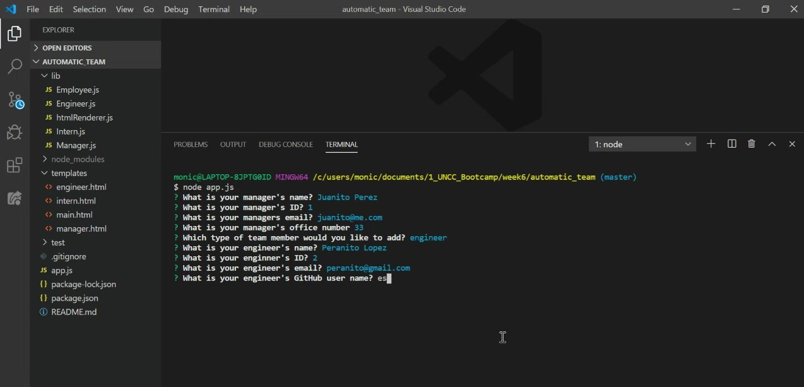
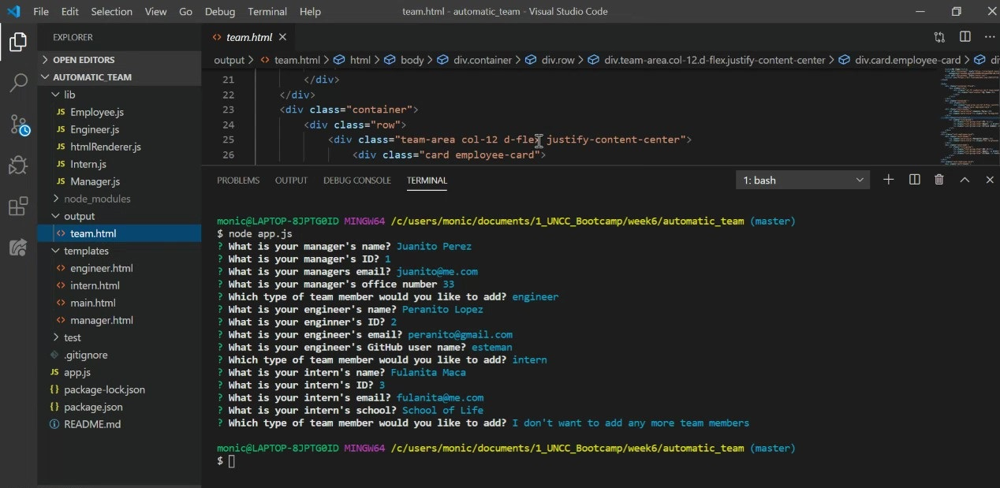
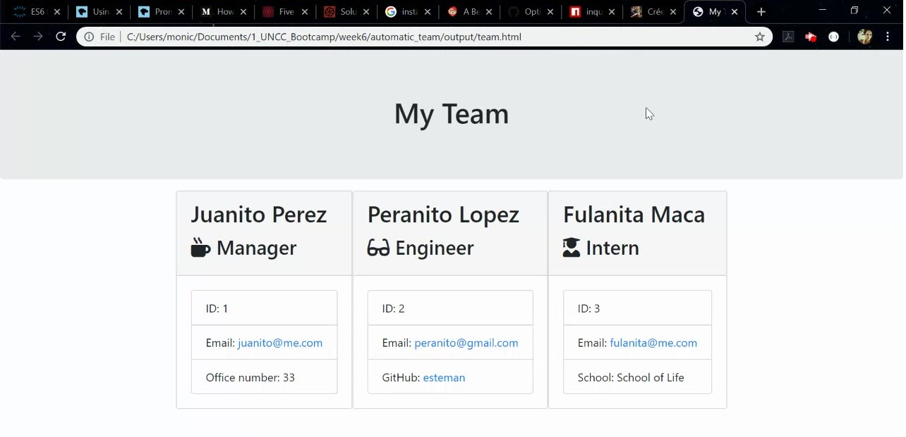

# automatic_team
Command line application that generates an html file with team member profiles.

## Table of Contents
* [Description](#Description)
* [Installation](#Installation)
* [Questions?](#Questions?)


## Description

Comman line app that prompts the user for information about the team manager and then information about the team members. The user can input any number of team members, and they may be a mix of engineers and interns.After user completes building the team, the application will create an HTML file that displays a nicely formatted team roster based on the information provided by the user.






## Installation
Run:
```
node app.js
```


## Questions?
Please contact:

GitHub user tantatinta

monicamgp@gmail.com